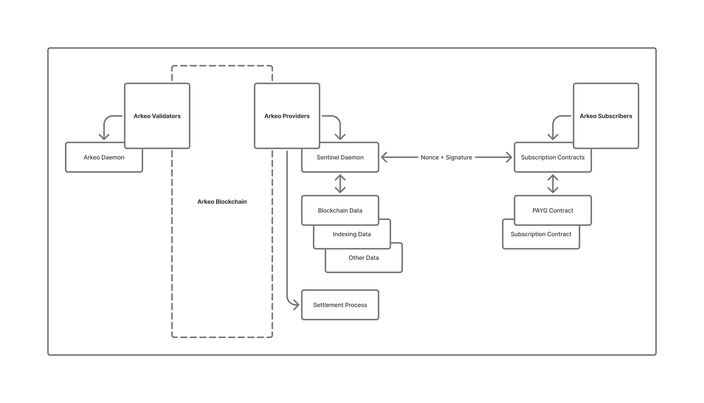

# The Arkeo Transaction Process Overview

Arkeo provides a robust, trustless payment model known as **"off-chain authorization with on-chain settlement"**. This model is efficient, scalable, and secure, leveraging blockchain technology while maintaining the speed and low cost of off-chain authorization.

## Understanding the Arkeo Transaction Model

In the Arkeo ecosystem, clients sign claims containing essential details such as usage information and a unique nonce (number used once) off-chain, authorizing resource usage without immediate blockchain settlement. Providers periodically submit these claims to the Arkeo blockchain through “claim-contract-income” transactions, effectively turning off-chain authorizations into on-chain settlements. This approach significantly enhances efficiency and scalability, and understanding nonce sequencing, ensuring robust Sentinel operations, and leveraging Cosmos SDK capabilities allows providers to deliver secure, reliable, and trustless metered billing services.

This approach is commonly referred to in the blockchain industry as:

- **Meta-transaction billing** 
- **Voucher-based payment channels** 
- **Off-chain signature with on-chain settlement**
- **Trustless metered billing**

## Technical Details

### Claims and Nonces:

A "claim" is a signed message from a client authorizing a specific amount of resource usage. Each claim includes a nonce, ensuring uniqueness and preventing replay attacks. Providers must carefully track the nonce numbers and associated client signatures, as mismatches between client nonces and on-chain sequence numbers can result in claim rejections.

### Sentinel and Event Handling:

The Arkeo Sentinel application is a key component that manages off-chain authorization and on-chain settlement. Sentinel subscribes to blockchain events via WebSocket, typically utilizing Tendermint/CometBFT RPC, which is enabled by the Cosmos SDK. Sentinel listens specifically for events related to contract state changes and claim settlements.

- It's important to note:
  - **If Sentinel is interrupted or paused, it may miss critical blockchain events.** 
  - **A missed event can result in a discrepancy between the internal state (ClaimStore) and the actual blockchain state.**
- Sentinel mitigates these risks by:
  - **Reindexing events upon restart or on-demand.** 
  - **Periodically synchronizing with a fully synced Arkeo node.**

## How Cosmos SDK Enables This Model

The Arkeo transaction process is built on the Cosmos SDK, which inherently supports flexible transaction and state management systems. Cosmos SDK provides built-in support for:

- **Handling custom messages and transactions, such as the Arkeo-specific claim-contract-income transactions.**
- **Event-driven architecture, allowing Sentinel to effectively subscribe and react to on-chain activities via Tendermint's WebSocket event system.**
- **Security and nonce management, providing tools to ensure transaction uniqueness and replay protection.**

## Best Practices for Providers

For smooth operations within the Arkeo system, providers should:
- **Continuously monitor the client's latest nonce and signatures.** 
- **Ensure Sentinel is always operational and connected to a synced Arkeo node.** 
- **Immediately restart Sentinel if desynchronization is suspected.** 
- **Implement periodic full-state refreshes or event replay mechanisms, particularly when reliability is paramount.**

## An Analogy:

### Here’s a simple analogy illustrating how Arkeo elegantly solves a timeless problem.

>**Tommy’s Neighborhood Lemonade Stand**
>
>Tommy opened a lemonade stand hoping for happy customers and quick profits—but things quickly went downhill. Customers complained about slow service, neighbors sometimes “forgot” to pay, and Tommy occasionally poured smaller cups by accident, creating mistrust. Soon, everyone was unhappy, and Tommy wasn’t making money.
>
> **Enter "Arkie"**
>
> Just when Tommy was ready to quit, he met Arkie, a friendly robot helper who changed everything. Arkie was precise, impartial, and efficient, exactly what Tommy needed.
>
> **Arkie’s Smart Lemonade System**
>
> * Neighborhood kids who wanted lemonade made an initial deposit with Arkie, creating mutual trust. Arkie holds the funds.
> * Kids could then freely pour lemonade whenever they wanted without stopping to pay each time. Arkie accurately counted every cup poured, never interrupting service.
> * At the end of each day, Arkie transparently calculated exactly how much lemonade each kid drank, automatically deducting the correct amount from their deposit. Everyone trusted Arkie’s fairness completely.
> * Any leftover funds were returned by Arkie to each kid, though naturally, they reinvested it right back into the next day's lemonade.
>
> **A Happy Ending**
>
> Suddenly, customers were happy again! Quick, fair service meant everyone got exactly what they paid for. Tommy began making consistent profits, eliminating complaints about mistrust or missed payments. Thanks to Arkie, Tommy’s lemonade stand thrived.
>
> **Why It Worked?**
>
> * **Fairness:** Precise tracking ensured honesty.
> * **Efficiency:** Fast, frictionless transactions kept customers happy.
> * **Cost Savings:** Kids paid only for what they drank—no waste, no frustration.
> * **Trust Restored:** Clear records eliminated doubts or disputes.
