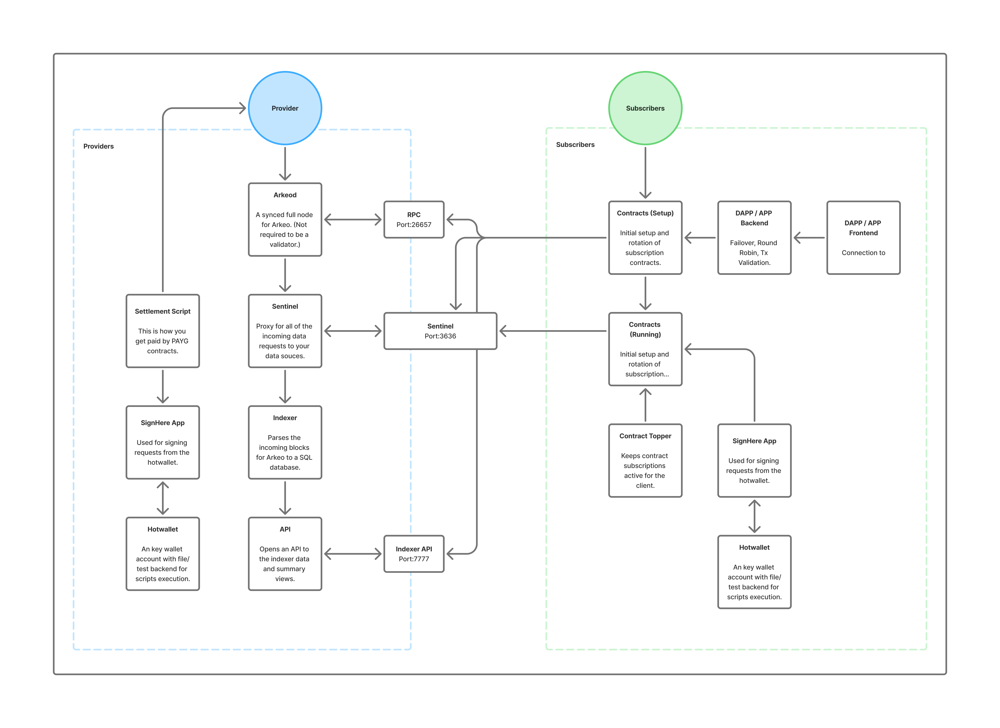
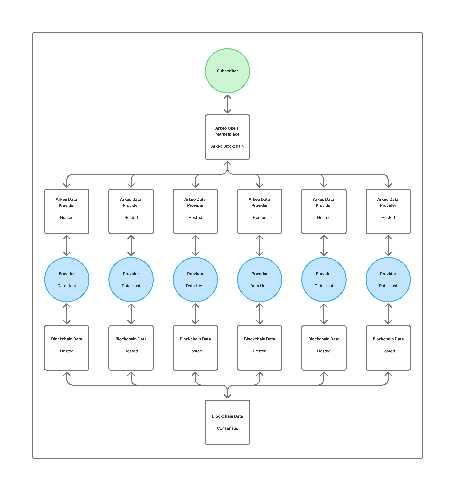

# What is an Arkeo Data Provider?

An **Arkeo Data Provider** is someone who helps keep critical blockchain and other valuable data accessible by sharing their infrastructure with the Arkeo network. By running nodes, APIs, or data endpoints and registering them in the Arkeo Open Data Marketplace, providers help developers and businesses reliably access data—and earn automatic, on-chain rewards for their efforts.

Simply put, providers are essential to keeping the Arkeo marketplace healthy, decentralized, and vibrant.

## Provider Overviews

### Provider & Subscriber Overview

In the Arkeo ecosystem, there are two main roles: **Providers** and **Subscribers**.

**Providers** set up and maintain their own infrastructure—such as Arkeo nodes, Sentinel proxies, data indexers, and APIs—making sure their endpoints are always available and responsive.

**Subscribers** are applications, developers, or businesses that need reliable access to blockchain data. They connect to provider services using clear, on-chain subscription contracts.

As a provider, you'll need to:
- Run a reliable Arkeo Node. 
- Set up a Sentinel Proxy to handle subscriber requests securely. 
- Offer an Indexer and API to organize blockchain data for easy querying. 
- Automate billing and settlement scripts to smoothly receive payments.

Here's how everything fits together visually:

### Arkeo Open Data Marketplace

The Arkeo Open Data Marketplace connects providers and subscribers in a transparent, decentralized environment. Think of it as an open hub where subscribers easily find providers who offer the data they need, and providers are fairly rewarded for their reliability and quality.

Here's how it works:
- Providers register their data endpoints on-chain. 
- Subscribers browse the marketplace to find providers that meet their needs. 
- Smart contracts handle payments and enforce agreements automatically.

This setup encourages healthy competition and redundancy—meaning subscribers always have reliable options, and providers benefit directly from their high-quality service.

Here's the big-picture view:

Providers Showing Open Marketplace Diagram

## What is Expected of You?

As an Arkeo Data Provider, you're expected to:

- **Stay Reliable:** Aim for high uptime and make sure subscribers can consistently access your endpoints. 
- **Maintain Accurate Data:** Ensure your data stays current and accurate by regularly syncing your node and indexer. 
- **Engage Actively:** Keep your endpoints visible and available in the marketplace, adapting as needed based on subscriber feedback. 
- **Automate Payments:** Run your payment scripts and settlement tools so you're compensated automatically and effortlessly.

While perfection isn't expected, striving for reliability ensures subscribers trust your services, and trust is key to success in an open market.

## Provider Feedback

As a provider, you truly are at the heart of the Arkeo system, and your voice matters!

Join our community on Discord:

- Share your thoughts and suggestions. 
- Help newcomers who might be facing challenges you've already conquered. 
- Request features that you think could make Arkeo even better.

Your input helps shape the future of decentralized data, and we deeply appreciate your involvement.

https://discord.com/channels/1050100146626642052/1359893459854688439

## Let's Get Setup

Ready to become an Arkeo Data Provider? Great!

Your next step is setting up your infrastructure and joining the Arkeo Open Data Marketplace.

[Go to setup](../subscribers/setup.md)

Join our Data-Providers channel on Discord:
[Arkeo Discord, Data-Providers](https://discord.com/channels/1050100146626642052/1359893459854688439)